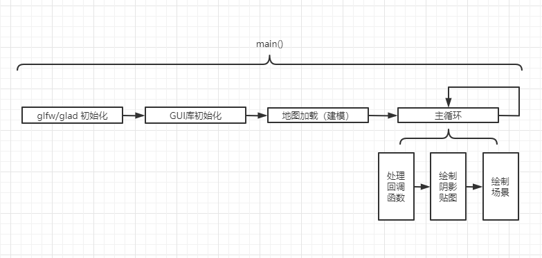
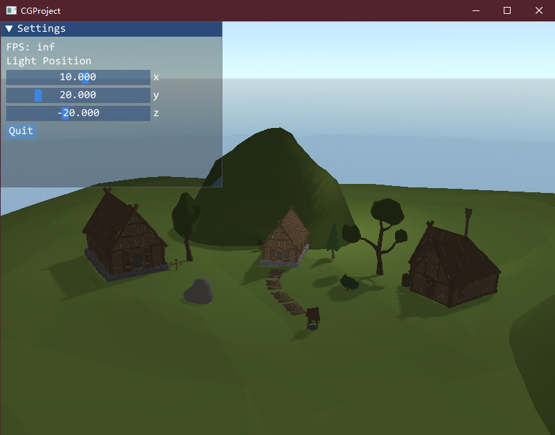

**介绍：**
基于Modern OpenGL，根据图形学课程和Learn OpenGL中所学的内容，制作了一个功能相对比较完善的游戏框架。
**主要功能：**

1. 模型加载：

主要有2种途径：

自己进行建模的（球，圆柱等），在构造函数时需要指定着色器，位置矩阵，纹理，颜色，大小等必要的参数。

对于导入的模型可以使用Assimp库，并且已经包含纹理、颜色，只需要指定位置、缩放即可。

从设计上来说，我们可以设计Object类和虚函数接口，不同模型继承、实现自己的接口。

后续可以通过txt/json格式文件导入我们的地图，这样的话可以避免在代码里hardcode

2. FPS相机

基本已经实现。

后续需要进行碰撞检测。大概方法是在Object类里记录一个boundingbox，即用一个长方形将每个物体框定起来，我们的人物也有一个boundingbox，在移动时候先判断是否会出现boundingbox相交的情况。由于物体数量不会超过3位

数，这个效率应该非常高。

选择圆柱体的好处是可以将它抽象成2步：高度判断和圆与圆之间的相交，判断起来非常简单，而长方体则可能需要考虑更多的问题。当然具体逻辑还需要沟通

3. 光照（着色器代码）

点光源、方向光源2种。主要是给着色器传参数，计算在着色器里。

1. Animation（Optional）

比如树叶摇动这些

**DONE**

1. 模型加载 + JSON读取
2. FPS相机
3. Phong光照模型
4. Skybox（2种）
5. Shadow Mapping
6. GUI（光源可编辑）
7. Shadow Mapping

**流程**

 **目前效果** 

​	操作：WASD移动，QE上下，滚轮控制远近

**一些细节**

1. 碰撞检测

（1）基本思路：由于我们的人物视作在2D的平面移动，所以我们可以通过长方形记录每个物体的size，然后通过translate、rotate和scale（这些可以在model里面增加成员变量实现）对长方形进行变换，最后在人物移动的时候计算是否有长方形的重叠。

（2）还有个问题是地面是不平整的，人物如果只能在2d移动的话可能会陷入地底，这个问题可能比较难解决，暂时不考虑。（可以通过找个平整的地方建模避免）

2. 光源可编辑

imgui库，导入到工程中就好了

3. 地图绘制

已经有一个比较完善的模型库，但是格式不同，需要自己自己通过unity3D转换成obj格式，然后放到地图中

地址: [RPG Poly Pack - Lite | CGTrader](https://www.cgtrader.com/items/2011355/download-page)

